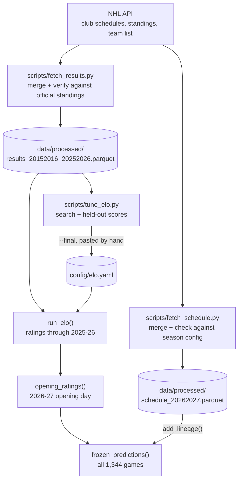

# Elo model, part 5: implementation

*Where each piece of the Elo model lives, how data flows through it, what the tests
cover, and how to reproduce every number in parts 1 to 4 from a fresh clone.*

## 1. The files involved

```
config/
  elo.yaml                     published settings + provenance
  season_2026_27.yaml          teams, divisions, dates (read by preseason_ratings.py)
src/nhlsim/
  models/elo.py                ratings, updates, frozen predictions, config loader
  models/baselines.py          home-win-rate baseline
  evaluate/metrics.py          log loss, Brier score (and the RPS used by the outcome model)
  evaluate/elo_tuning.py       objectives, alternating search, score tables
  ingest/franchises.py         team IDs -> franchise lineage
  ingest/results.py            loading verified results, adding lineage IDs
  ingest/schedule.py           loading the season schedule; "played" rule
scripts/
  fetch_results.py             download + verify historical results
  fetch_schedule.py            download + verify the 2026-27 schedule
  tune_elo.py                  tuning, held-out evaluation, --final settings
  preseason_ratings.py         2026-27 opening ratings + frozen probabilities
tests/
  test_elo.py  test_elo_tuning.py  test_metrics.py  test_lineage.py
```

## 2. Data flow



Everything under `data/` is generated locally and not committed; the fetch scripts
recreate it. Results are only written after every team's record recomputed from our
games matches the NHL's official final standings for all 344 team-seasons, so the
Elo model starts from verified data.

## 3. Input: the results table

`run_elo` reads a results table (the schema in `nhlsim.ingest.results`) and uses
these columns: `game_id`, `season_id`, `start_time_utc`, `game_state`,
`home_score`, `away_score`, `last_period_type`, `home_lineage_id`,
`away_lineage_id`.

- Only **played** games are used: state `OFF` or `FINAL`, via `is_played()` from
  `nhlsim.ingest.schedule`. A live game with a score is ignored.
- Games are processed in `start_time_utc` order, ties broken by `game_id`.
- Teams are identified by **lineage ID**, never by abbreviation or team ID
  (part 4, decision 10).
- Before anything runs, the input is checked, and any of these raises `EloError`:
  duplicate game IDs, missing lineage IDs, a team playing itself, a played game
  without both scores, a tie, an unknown last period type, an overtime or shootout
  game not decided by exactly one goal, or seasons out of time order. The result
  rules (scores, ties, period type, one-goal margin) are one shared function,
  `played_result_problems` in `nhlsim.ingest.results`, also used by the historical
  results check and by `team_records`, so every reader of played games applies the
  same rules.

## 4. `nhlsim.models.elo`

**Settings.** `EloParams` holds `k`, `home_advantage`, `season_regression` (c),
`shootout_as_draw` (default off), `margin_weight` (λ, default 0) and
`initial_rating` (default 1500). Like every config model in the project it is
immutable, rejects unknown keys (a typo fails loudly instead of silently using a
default), never converts types (`k: "9"` or `shootout_as_draw: "yes"` is an error, not
9 or true), and validates values: K must be positive, c between 0 and 1, λ
non-negative, nothing infinite or NaN.

**Probabilities.** `home_win_probability(rating_diff)` is the logistic formula of
part 2, with `SCALE = 400`. `regress(rating, params)` applies the between-season
pull.

**`run_elo(games, params) -> EloRun`.** The whole rating history in one pass, a
plain loop over the games (part 4, decision 20). The result has three tables:

| Attribute | One row per | Columns | Used for |
|---|---|---|---|
| `games` | played game, in processing order | `GAME_PREDICTIONS_SCHEMA`: IDs, both pre-game ratings, `p_home`, `home_won` | Daily log loss |
| `season_start` | team and season | `RATINGS_SCHEMA`: `season_id`, `lineage_id`, `rating` going into its first game | Frozen predictions in backtests |
| `final` | team | `RATINGS_SCHEMA`, with the season of the team's last game | Next season's opening ratings |

**`opening_ratings(final, params, season_id, lineage_ids)`.** Opening ratings for a
new season: known teams pulled toward 1500 once, new teams at 1500. Refuses a
season that isn't after every season in `final`. A team that sat out seasons at the
end of the data (none so far) was already pulled once per missed season inside
`run_elo`, as it would have been had it returned, so it gets one pull per season
start since its last game in total.

**`frozen_predictions(games, season_start, params)`.** Predicts every game from its
season's opening ratings, never updated (part 2, section 9). Unplayed games are
included, with `home_won` null: that is what the preseason freeze needs. Raises
`EloError` if a played game has a malformed result (the same rules as `run_elo`) or
a team has no opening rating for that season.

**Config.** `load_elo_config(path) -> EloConfig` reads `config/elo.yaml`: an
`EloParams` plus an `EloTuning` block recording the warm-up start, the tuning
seasons and the generating command. Season IDs must be well formed and in order
(warm-up before tuning). The loader lives here rather than in `nhlsim.config` so
that dependencies point one way: models may use config, not the reverse.

## 5. Evaluation modules

**`nhlsim.evaluate.metrics`.** `log_loss(p, outcome)` and `brier(p, outcome)` on a
float Series of probabilities and a boolean Series of outcomes. Both reject
mismatched lengths, empty input, missing values, NaN or infinity and wrong types;
log loss also rejects probabilities of exactly 0 or 1 (part 4, decision 15). The
module also has `rps`, the ranked probability score used to score the outcome model
([simulator part 1](../simulator/01-outcome-split.md)).

**`nhlsim.models.baselines`.** `home_win_rate(games)`: the share of played games won
by the home team, learned from whatever games it is given. Callers must pass only
the games the baseline may learn from.

**`nhlsim.evaluate.elo_tuning`.**

- `daily_log_loss(games, params, seasons)` and `frozen_log_loss(games, params,
  seasons)`: the two objectives of part 3, section 4.
- `Grid`: candidate values for each setting; `update_candidates(c)` expands every
  combination of the daily settings for a fixed c.
- `tune(daily, frozen, grid, *, start_regression, max_rounds=5) -> TuningResult`:
  the alternating search. It takes the two objectives as functions, so the tests
  can check its logic on made-up functions with known minima. The result holds the
  chosen settings, every round (with the full score table of each search) and
  whether it converged.
- `at_grid_edge(params, grid)`: settings whose chosen value is the smallest or
  largest candidate.
- `season_scores(predictions, seasons, home_rate)`: per-season and pooled log
  loss, Brier score and both baselines (the tables in part 3, section 7).
- `calibration_table(predictions, seasons, bins=10)`: predicted against observed
  home win rate by probability bin.

All scoring functions raise if any requested season has no played games, so a
mistyped season can't silently drop out of a score.

**`nhlsim.ingest.franchises.lineage_of(team_ids, teams)`.** Maps one season's NHL
team IDs to lineage IDs using the team table. It fails on an unknown team, a team
given twice, or two teams sharing a lineage (Arizona and Utah can never appear in
the same season).

## 6. `config/elo.yaml`

```yaml
params:
  k: 9.0
  home_advantage: 27.5
  season_regression: 0.3
  shootout_as_draw: false
  margin_weight: 0.0
  initial_rating: 1500.0
tuning:
  warm_up_first: 20152016
  tuning_first: 20172018
  tuning_last: 20252026
  source: "scripts/tune_elo.py --final"
```

The file is generated by `tune_elo.py --final`, which prints it; it is pasted in and
reviewed by hand, and no script ever writes it. A test loads the real file and
checks its values, so a change to the published settings can't slip in unnoticed.

## 7. Scripts

Scripts are thin: argument parsing, loading, printing. Their logic lives in the
tested modules above, so the scripts themselves have no tests.

**`scripts/tune_elo.py`** writes nothing; it prints a report.

| Option | Default | Meaning |
|---|---|---|
| `--results` | `data/processed/results_20152016_20252026.parquet` | Results file |
| `--tune-first` | 20172018 | First tuning season; everything before is warm-up |
| `--tune-last` | 20212022 (last season with `--final`) | Last tuning season |
| `--test-first`, `--test-last` | 20222023, 20252026 | Held-out seasons |
| `--final` | off | Tune on every season after the warm-up; print `config/elo.yaml` |

Without `--final` it runs two searches: plain Elo (with sensitivity, per-season
scores and calibration) and the update variants (with the held-out comparison).
About two minutes in total. With `--final` it refuses to print settings if the
search did not converge or a value sits at the edge of its grid. It also refuses to
run without a warm-up season, or with held-out seasons that don't come after the
tuning seasons.

**`scripts/preseason_ratings.py`** writes nothing; it prints the opening ratings and
a preview of the frozen probabilities. Before computing anything it checks that the
schedule matches the season config, that the results end with the season just
before the new one, and that every team maps to a lineage; afterwards, that the
league mean is exactly 1500. Options: `--config`, `--elo`, `--results`, `--teams`,
`--schedule` (defaults under `config/` and `data/processed/`).

## 8. Tests

These four files hold 159 of the project's 402 tests (September 2026):

| File | Tests | Covers |
|---|---|---|
| `test_elo.py` | 78 | Updates, home advantage, both variants, zero sum, no leakage, time order, unplayed games, the between-season pull, expansion teams, Arizona → Utah, frozen predictions (including malformed results and duplicate opening ratings), opening ratings, input and settings validation, the real `config/elo.yaml` |
| `test_elo_tuning.py` | 22 | Both objectives on real games, score and calibration tables, seasons with no games refused, the search (separate minima, alternating convergence, non-convergence, ties, grid edges) |
| `test_metrics.py` | 54 | Log loss and Brier by hand, input validation, the home-rate baseline; 27 of them cover the ranked probability score used by the outcome model |
| `test_lineage.py` | 5 | Lineage mapping and its failure cases |

Principles:

- **Real data.** Every game in a test fixture is a real game copied from the
  verified results, with its real IDs, times and scores (e.g. game 2015020001,
  Montréal 3 at Toronto 1).
- **Expected values worked out by hand**, independently of the code, and written in
  the test's docstring: for example, $`P = 1/(1 + 10^{10/400}) = 0.485613`$ for the
  second fixture game.
- **Properties, not just values:** ratings sum to a constant; changing a game's
  result leaves that game's prediction and all earlier ones unchanged; shuffling
  the input changes nothing.
- **Tests that can fail.** During development, each piece of logic was deliberately
  broken, one at a time (89 variations across these modules), and at least one test
  had to fail for each. Three variations initially passed, because every test used
  K = 20 and a starting rating of 1500, so hard-coding either went unnoticed; tests
  with other values were added.

## 9. Reproducing everything from a fresh clone

Requires Python 3.12 and [uv](https://docs.astral.sh/uv/). From the repo root:

```
uv sync                                          # install exact versions (uv.lock)
uv run pytest                                    # all tests
uv run python scripts/fetch_results.py           # ~3 min: 13,512 games, verified
uv run python scripts/fetch_schedule.py          # ~20 s: 2026-27 schedule, verified
uv run python scripts/tune_elo.py                # ~2 min: part 3, sections 5-9
uv run python scripts/tune_elo.py --final        # part 3, section 10 (config/elo.yaml)
uv run python scripts/preseason_ratings.py       # part 1: 2026-27 opening ratings
```

The fetch scripts save API responses under `data/raw/nhl_api/`. `fetch_results.py`
reuses them (finished seasons never change; `--refresh` downloads them again), so
later runs are fast and don't touch the API. `fetch_schedule.py` downloads the
2026-27 schedule fresh on every run, because the NHL can still change it
(postponements); `--cached` reuses the saved files instead and prints how old the
oldest one is. The results are deterministic: the same data and settings give the
same numbers to the last digit. The one caveat is that schedule: fetched on a
different day, it can differ, and so can the preview.

## 10. Adding or changing something

To test a new idea in the Elo model, e.g. a variable K:

1. Add a setting to `EloParams` whose default reproduces the current model exactly,
   so the published model is unaffected until a decision is made.
2. Add tests with values worked out by hand, including one showing the default
   matches plain Elo.
3. Add the setting to the variant grid in `tune_elo.py` and compare. Because the
   four held-out seasons have already been used (part 4, decision 16), a new
   variant should be judged with the walk-forward backtest planned for task 2.1
   rather than by looking at those seasons again.
4. If it is adopted, regenerate `config/elo.yaml` with `--final`, and record the
   decision in part 4.
